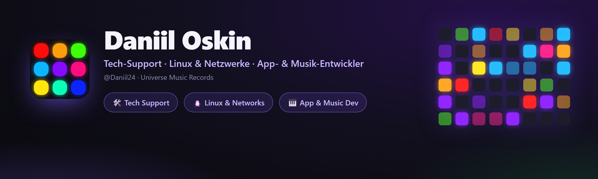

<div align="center">



<br><br>

[](https://t.me/universemusicrecords)
[](mailto:doskin50@gmail.com)
[](https://open.spotify.com/artist/52i91BwNbmPpqL4KVlFeIG)

<br>

[Русский](README.md) · [English](README.en.md) · [Українська](README.uk.md) · 🌍 **Deutsch** · [Español](README.es.md) · [Français](README.fr.md)

</div>

---

## 👋 Über mich

Hi! Ich bin **Daniil Oskin** und lebe an der Schnittstelle zweier Welten — **Technik** und **Musik**.

Tagsüber bin ich **Tech-Support-Spezialist** bei Telekom-Anbietern (**Rostelecom**, **ER-Telecom Holding**): 2nd-Level-Support, Netzwerke reparieren, Geräte einrichten, in Linux graben. Abends **baue ich eigene Apps** in Python und **mache Musik** unter der Marke **Universe Music Records / Magic Music Record**.

Ich bringe Dinge gern in einen „verkaufsfertigen" Zustand — zuverlässig und schön — sei es GPON-Netzdiagnose, mein eigener VPN-Dienst oder eine Desktop-App mit Animationen und Lightshow.

📍 Tomsk · 🌐 remote · 🇷🇺 RU / 🇬🇧 EN

---

## 💼 Was ich mache

<table>
<tr>
<td width="33%" valign="top">

### 🛠 Tech-Support
2nd Level im Telekom. Netzdiagnose, **GPON/IPTV**, Router-/ONT-Einrichtung, Incident-Bearbeitung, **SLA**, Jira / Service Desk.

</td>
<td width="33%" valign="top">

### 🐧 Linux & Netzwerke
TCP/IP, DNS · DHCP · NAT · PPPoE · VLAN. Eigenes **WireGuard/OpenVPN-VPN**, Bash-Automatisierung, SSH, Wireshark, Debian/Ubuntu.

</td>
<td width="33%" valign="top">

### 🎹 Dev & Musik
Desktop-Apps in **Python** (MIDI, Audio, Lightshow) und Produktion unter **Magic Music Record**.

</td>
</tr>
</table>

---

## 🚀 Projekte

<div align="center">

<a href="https://github.com/Daniil24/launchpad-deck"></a>
<a href="https://github.com/Daniil24/minilab-key-deck"></a>

</div>

### 🎛 [Launchpad Deck](https://github.com/Daniil24/launchpad-deck)
Macht aus einem **Novation Launchpad** ein **Makro-Deck** (wie ein Stream Deck) **und** eine audioreaktive **Lightshow** zugleich.
- 60+ generative Szenen, App-Start, OBS-Steuerung, App-Lautstärke, Mikrofon-Mute.
- Anpassung an Mini MK3 / X / **Pro MK3 (10×10)**. Eine `.exe`, **6 Sprachen**, Animationen.

### 🎹 [MiniLab Key Deck](https://github.com/Daniil24/minilab-key-deck)
Macht aus einem **Arturia MiniLab 3** (und jedem MIDI-Controller) eine Tastatur für **Rhythmusspiele** — Fortnite Festival, osu!, Clone Hero.
- Tasten-/Pad-Mapping, **Velocity-Zonen**, Regler/Fader → Rad/Lautstärke/Tasten.
- Live-Oktav-Anzeige, **Pad-Lightshow**, Tray + Hotkey, **6 Sprachen**, eine `.exe`.

### 🛡 MAGIC VPN — Telegram-VPN-Dienst
Mein eigener **VPN-Dienst in Telegram**: dem Bot schreiben — Schlüssel und Abo erhalten.
- Viele Server und Standorte, **VLESS / Hysteria2**-Protokolle, Zensur-Umgehung (Cloudflare WS-CDN).
- **Android- und PC-Clients**, Bezahlung auf der Website, Auto-Standortwahl, Werbung-für-Minuten, Android-Stealth-Modus.

[](https://telegram.me/magicvpnsub_bot)
[](https://pay.magicvpssub.ru/)

---

## 🧰 Tech-Stack

**Entwicklung**  


**Linux & Netzwerke**  


**Hardware & Support**  


---

## 🎧 Musik — *Magic Music Record*

Ich schreibe und produziere Musik als **Magic Music Record** (Label **Universe Music Records**). Hör rein auf deiner Lieblingsplattform:

[](https://open.spotify.com/artist/52i91BwNbmPpqL4KVlFeIG)
[](https://www.deezer.com/en/artist/97111002)
[](https://www.youtube.com/channel/UClHADc2wuHte3u5XV55JI6Q)
[](https://www.youtube.com/channel/UCEZSIzoLzq3HVlG4dGNnD4g)
[](https://soundbetter.com/profiles/477542-magic-music-record)

---

## 🌱 Aktuell

- 🔭 Baue **Launchpad Deck** und **MiniLab Key Deck** weiter aus (neue Funktionen, Sprachen).
- 📚 Vertiefe **Linux-Administration und Netzwerktechnik**.
- 🎼 Schreibe neue Musik als **Magic Music Record**.
- 🛡 Entwickle meinen eigenen **VPN-Dienst**.

---

## 💜 Unterstützen

Die Projekte sind kostenlos. Wenn sie dir geholfen haben, kannst du mich mit Krypto unterstützen — **TON (Toncoin)**:

```
UQAK1sIJqPVn9ND8JTOEUlrBFyAiVU0j6IiiXczTM7YmX4CB
```

[](https://app.tonkeeper.com/transfer/UQAK1sIJqPVn9ND8JTOEUlrBFyAiVU0j6IiiXczTM7YmX4CB)

<div align="center">

<br>

**Universe Music Records · Magic Music Record**

</div>
