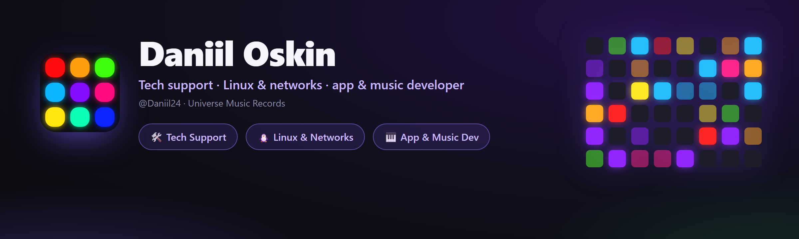

<div align="center">



<br><br>

[](https://t.me/universemusicrecords)
[](mailto:doskin50@gmail.com)
[](https://open.spotify.com/artist/52i91BwNbmPpqL4KVlFeIG)

<br>

[Русский](README.md) · 🌍 **English** · [Українська](README.uk.md) · [Deutsch](README.de.md) · [Español](README.es.md) · [Français](README.fr.md)

</div>

---

## 👋 About me

Hi! I'm **Daniil Oskin**, living at the intersection of two worlds — **tech** and **music**.

By day I'm a **tech-support specialist** at telecom providers (**Rostelecom**, **ER-Telecom Holding**): 2nd-line support, fixing networks, configuring gear, digging into Linux. By night I **build my own apps** in Python and **make music** under the **Universe Music Records / Magic Music Record** brand.

I like taking things to a "ready-to-sell" state — reliable and good-looking — whether it's GPON network diagnostics, my own VPN service, or a desktop app with animations and a light show.

📍 Tomsk · 🌐 remote · 🇷🇺 RU / 🇬🇧 EN

---

## 💼 What I do

<table>
<tr>
<td width="33%" valign="top">

### 🛠 Tech support
2nd line at a telecom. Network diagnostics, **GPON/IPTV**, router/ONT setup, incident handling, **SLA**, Jira / Service Desk.

</td>
<td width="33%" valign="top">

### 🐧 Linux & networks
TCP/IP, DNS · DHCP · NAT · PPPoE · VLAN. My own **WireGuard/OpenVPN VPN**, Bash automation, SSH, Wireshark, Debian/Ubuntu.

</td>
<td width="33%" valign="top">

### 🎹 Dev & music
Desktop apps in **Python** (MIDI, audio, light show) and producing under **Magic Music Record**.

</td>
</tr>
</table>

---

## 🚀 Featured projects

<div align="center">

<a href="https://github.com/Daniil24/launchpad-deck"></a>
<a href="https://github.com/Daniil24/minilab-key-deck"></a>

</div>

### 🎛 [Launchpad Deck](https://github.com/Daniil24/launchpad-deck)
Turns a **Novation Launchpad** into a **macro deck** (like a Stream Deck) **and** an audio-reactive **light show** at once.
- 60+ generative scenes, app launching, OBS control, per-app volume, mic mute.
- Adapts to Mini MK3 / X / **Pro MK3 (10×10)**. One `.exe`, **6 languages**, animations.

### 🎹 [MiniLab Key Deck](https://github.com/Daniil24/minilab-key-deck)
Turns an **Arturia MiniLab 3** (and any MIDI controller) into a keyboard for **rhythm games** — Fortnite Festival, osu!, Clone Hero.
- Key/pad mapping, **velocity zones**, knobs/faders → wheel/volume/keys.
- Live octave indicator, **pad light show**, tray + hotkey, **6 languages**, one `.exe`.

### 🛡 MAGIC VPN — a Telegram VPN service
My own **VPN service in Telegram**: message the bot — get a key and a subscription.
- Many servers and locations, **VLESS / Hysteria2** protocols, censorship bypass (Cloudflare WS-CDN).
- **Android and PC clients**, payment on the site, auto location pick, ad-for-minutes, Android stealth mode.

[](https://telegram.me/magicvpnsub_bot)
[](https://pay.magicvpssub.ru/)

---

## 🧰 Tech stack

**Development**  


**Linux & networks**  


**Gear & support**  


---

## 🎧 Music — *Magic Music Record*

I write and produce music as **Magic Music Record** (**Universe Music Records** label). Listen on your favourite platform:

[](https://open.spotify.com/artist/52i91BwNbmPpqL4KVlFeIG)
[](https://www.deezer.com/en/artist/97111002)
[](https://www.youtube.com/channel/UClHADc2wuHte3u5XV55JI6Q)
[](https://www.youtube.com/channel/UCEZSIzoLzq3HVlG4dGNnD4g)
[](https://soundbetter.com/profiles/477542-magic-music-record)

---

## 🌱 Currently

- 🔭 Growing **Launchpad Deck** and **MiniLab Key Deck** (new features, languages).
- 📚 Going deeper into **Linux administration and network engineering**.
- 🎼 Writing new music as **Magic Music Record**.
- 🛡 Developing my own **VPN service**.

---

## 💜 Support

My projects are free. If they helped you, you can support me with crypto — **TON (Toncoin)**:

```
UQAK1sIJqPVn9ND8JTOEUlrBFyAiVU0j6IiiXczTM7YmX4CB
```

[](https://app.tonkeeper.com/transfer/UQAK1sIJqPVn9ND8JTOEUlrBFyAiVU0j6IiiXczTM7YmX4CB)

<div align="center">

<br>

**Universe Music Records · Magic Music Record**

</div>
