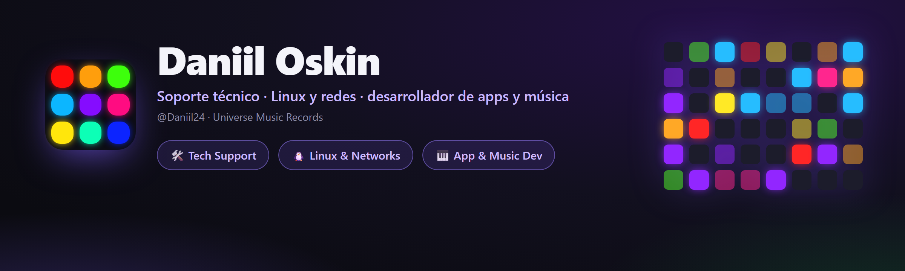

<div align="center">



<br><br>

[](https://t.me/universemusicrecords)
[](mailto:doskin50@gmail.com)
[](https://open.spotify.com/artist/52i91BwNbmPpqL4KVlFeIG)

<br>

[Русский](README.md) · [English](README.en.md) · [Українська](README.uk.md) · [Deutsch](README.de.md) · 🌍 **Español** · [Français](README.fr.md)

</div>

---

## 👋 Sobre mí

¡Hola! Soy **Daniil Oskin**, viviendo en el cruce de dos mundos — **tecnología** y **música**.

De día soy **especialista de soporte técnico** en operadores de telecomunicaciones (**Rostelecom**, **ER-Telecom Holding**): 2ª línea de soporte, reparo redes, configuro equipos, hurgo en Linux. De noche **creo mis propias apps** en Python y **hago música** bajo la marca **Universe Music Records / Magic Music Record**.

Me gusta dejar las cosas «listas para vender» — fiables y bonitas — ya sea diagnóstico de red GPON, mi propio servicio VPN o una app de escritorio con animaciones y show de luces.

📍 Tomsk · 🌐 remoto · 🇷🇺 RU / 🇬🇧 EN

---

## 💼 Qué hago

<table>
<tr>
<td width="33%" valign="top">

### 🛠 Soporte técnico
2ª línea en telecom. Diagnóstico de redes, **GPON/IPTV**, configuración de routers/ONT, gestión de incidentes, **SLA**, Jira / Service Desk.

</td>
<td width="33%" valign="top">

### 🐧 Linux y redes
TCP/IP, DNS · DHCP · NAT · PPPoE · VLAN. Mi propia **VPN con WireGuard/OpenVPN**, automatización con Bash, SSH, Wireshark, Debian/Ubuntu.

</td>
<td width="33%" valign="top">

### 🎹 Desarrollo y música
Apps de escritorio en **Python** (MIDI, audio, show de luces) y producción bajo **Magic Music Record**.

</td>
</tr>
</table>

---

## 🚀 Proyectos

<div align="center">

<a href="https://github.com/Daniil24/launchpad-deck"></a>
<a href="https://github.com/Daniil24/minilab-key-deck"></a>

</div>

### 🎛 [Launchpad Deck](https://github.com/Daniil24/launchpad-deck)
Convierte un **Novation Launchpad** en un **deck de macros** (como un Stream Deck) **y** un **show de luces** reactivo al audio a la vez.
- 60+ escenas generativas, lanzar apps, control de OBS, volumen por app, silenciar micro.
- Se adapta a Mini MK3 / X / **Pro MK3 (10×10)**. Un `.exe`, **6 idiomas**, animaciones.

### 🎹 [MiniLab Key Deck](https://github.com/Daniil24/minilab-key-deck)
Convierte un **Arturia MiniLab 3** (y cualquier controlador MIDI) en un teclado para **juegos de ritmo** — Fortnite Festival, osu!, Clone Hero.
- Mapeo de teclas/pads, **zonas de velocidad**, perillas/faders → rueda/volumen/teclas.
- Indicador de octava en vivo, **show de luces en pads**, bandeja + atajo, **6 idiomas**, un `.exe`.

### 🛡 MAGIC VPN — servicio VPN en Telegram
Mi propio **servicio VPN en Telegram**: escribes al bot y obtienes una clave y una suscripción.
- Muchos servidores y ubicaciones, protocolos **VLESS / Hysteria2**, evasión de bloqueos (Cloudflare WS-CDN).
- **Clientes para Android y PC**, pago en la web, elección automática de ubicación, publicidad-por-minutos, modo sigiloso en Android.

[](https://telegram.me/magicvpnsub_bot)
[](https://pay.magicvpssub.ru/)

---

## 🧰 Stack

**Desarrollo**  


**Linux y redes**  


**Equipos y soporte**  


---

## 🎧 Música — *Magic Music Record*

Escribo y produzco música como **Magic Music Record** (sello **Universe Music Records**). Escucha en tu plataforma favorita:

[](https://open.spotify.com/artist/52i91BwNbmPpqL4KVlFeIG)
[](https://www.deezer.com/en/artist/97111002)
[](https://www.youtube.com/channel/UClHADc2wuHte3u5XV55JI6Q)
[](https://www.youtube.com/channel/UCEZSIzoLzq3HVlG4dGNnD4g)
[](https://soundbetter.com/profiles/477542-magic-music-record)

---

## 🌱 Ahora mismo

- 🔭 Mejorando **Launchpad Deck** y **MiniLab Key Deck** (nuevas funciones, idiomas).
- 📚 Profundizando en **administración de Linux e ingeniería de redes**.
- 🎼 Escribiendo nueva música como **Magic Music Record**.
- 🛡 Desarrollando mi propio **servicio VPN**.

---

## 💜 Apoyar

Los proyectos son gratis. Si te han servido, puedes apoyarme con cripto — **TON (Toncoin)**:

```
UQAK1sIJqPVn9ND8JTOEUlrBFyAiVU0j6IiiXczTM7YmX4CB
```

[](https://app.tonkeeper.com/transfer/UQAK1sIJqPVn9ND8JTOEUlrBFyAiVU0j6IiiXczTM7YmX4CB)

<div align="center">

<br>

**Universe Music Records · Magic Music Record**

</div>
