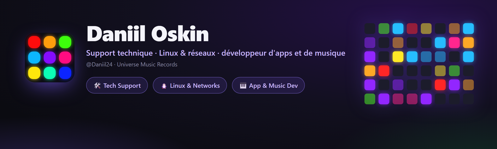

<div align="center">



<br><br>

[](https://t.me/universemusicrecords)
[](mailto:doskin50@gmail.com)
[](https://open.spotify.com/artist/52i91BwNbmPpqL4KVlFeIG)

<br>

[Русский](README.md) · [English](README.en.md) · [Українська](README.uk.md) · [Deutsch](README.de.md) · [Español](README.es.md) · 🌍 **Français**

</div>

---

## 👋 À propos de moi

Salut ! Je suis **Daniil Oskin**, à la croisée de deux mondes — la **tech** et la **musique**.

Le jour, je suis **spécialiste du support technique** chez des opérateurs télécom (**Rostelecom**, **ER-Telecom Holding**) : support de 2e ligne, réparation de réseaux, configuration d'équipements, plongée dans Linux. Le soir, je **crée mes propres applis** en Python et je **fais de la musique** sous la marque **Universe Music Records / Magic Music Record**.

J'aime amener les choses à un état « prêt à vendre » — fiable et beau — que ce soit un diagnostic de réseau GPON, mon propre service VPN ou une appli de bureau avec animations et light show.

📍 Tomsk · 🌐 à distance · 🇷🇺 RU / 🇬🇧 EN

---

## 💼 Ce que je fais

<table>
<tr>
<td width="33%" valign="top">

### 🛠 Support technique
2e ligne en télécom. Diagnostic réseau, **GPON/IPTV**, configuration routeurs/ONT, gestion des incidents, **SLA**, Jira / Service Desk.

</td>
<td width="33%" valign="top">

### 🐧 Linux & réseaux
TCP/IP, DNS · DHCP · NAT · PPPoE · VLAN. Mon propre **VPN WireGuard/OpenVPN**, automatisation Bash, SSH, Wireshark, Debian/Ubuntu.

</td>
<td width="33%" valign="top">

### 🎹 Dev & musique
Applis de bureau en **Python** (MIDI, audio, light show) et production sous **Magic Music Record**.

</td>
</tr>
</table>

---

## 🚀 Projets

<div align="center">

<a href="https://github.com/Daniil24/launchpad-deck"></a>
<a href="https://github.com/Daniil24/minilab-key-deck"></a>

</div>

### 🎛 [Launchpad Deck](https://github.com/Daniil24/launchpad-deck)
Transforme un **Novation Launchpad** en **deck de macros** (comme un Stream Deck) **et** un **light show** réactif à l'audio, à la fois.
- 60+ scènes génératives, lancement d'applis, contrôle d'OBS, volume par appli, mute du micro.
- S'adapte au Mini MK3 / X / **Pro MK3 (10×10)**. Un `.exe`, **6 langues**, animations.

### 🎹 [MiniLab Key Deck](https://github.com/Daniil24/minilab-key-deck)
Transforme un **Arturia MiniLab 3** (et tout contrôleur MIDI) en clavier pour **jeux de rythme** — Fortnite Festival, osu!, Clone Hero.
- Mapping touches/pads, **zones de vélocité**, potards/faders → molette/volume/touches.
- Indicateur d'octave en direct, **light show sur les pads**, barre d'état + raccourci, **6 langues**, un `.exe`.

### 🛡 MAGIC VPN — service VPN sur Telegram
Mon propre **service VPN sur Telegram** : tu écris au bot, tu reçois une clé et un abonnement.
- Nombreux serveurs et emplacements, protocoles **VLESS / Hysteria2**, contournement du blocage (Cloudflare WS-CDN).
- **Clients Android et PC**, paiement sur le site, choix auto de l'emplacement, pub-contre-minutes, mode furtif sur Android.

[](https://telegram.me/magicvpnsub_bot)
[](https://pay.magicvpssub.ru/)

---

## 🧰 Stack

**Développement**  


**Linux & réseaux**  


**Matériel & support**  


---

## 🎧 Musique — *Magic Music Record*

J'écris et je produis de la musique sous le nom **Magic Music Record** (label **Universe Music Records**). Écoute sur ta plateforme préférée :

[](https://open.spotify.com/artist/52i91BwNbmPpqL4KVlFeIG)
[](https://www.deezer.com/en/artist/97111002)
[](https://www.youtube.com/channel/UClHADc2wuHte3u5XV55JI6Q)
[](https://www.youtube.com/channel/UCEZSIzoLzq3HVlG4dGNnD4g)
[](https://soundbetter.com/profiles/477542-magic-music-record)

---

## 🌱 En ce moment

- 🔭 Je fais évoluer **Launchpad Deck** et **MiniLab Key Deck** (nouvelles fonctions, langues).
- 📚 J'approfondis **l'administration Linux et l'ingénierie réseau**.
- 🎼 J'écris de nouveaux morceaux sous **Magic Music Record**.
- 🛡 Je développe mon propre **service VPN**.

---

## 💜 Soutenir

Les projets sont gratuits. S'ils t'ont aidé, tu peux me soutenir en crypto — **TON (Toncoin)** :

```
UQAK1sIJqPVn9ND8JTOEUlrBFyAiVU0j6IiiXczTM7YmX4CB
```

[](https://app.tonkeeper.com/transfer/UQAK1sIJqPVn9ND8JTOEUlrBFyAiVU0j6IiiXczTM7YmX4CB)

<div align="center">

<br>

**Universe Music Records · Magic Music Record**

</div>
