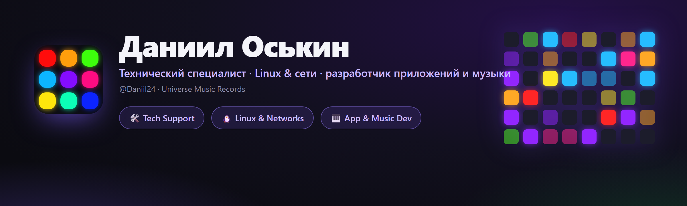

<div align="center">



<br><br>

[](https://t.me/universemusicrecords)
[](mailto:doskin50@gmail.com)
[](https://open.spotify.com/artist/52i91BwNbmPpqL4KVlFeIG)

</div>

---

## 👋 Обо мне / About me

Привет! Меня зовут **Даниил Оськин**. Я на стыке двух миров: **технологии** и **музыка**.

Днём я — **технический специалист** телеком-провайдеров (**Ростелеком**, **ЭР-Телеком Холдинг**): работаю на 2-й линии поддержки, чиню сети, настраиваю оборудование, копаюсь в Linux. Вечером — **пишу собственные приложения** на Python и **делаю музыку** под брендом **Universe Music Records / Magic Music Record**.

Мне нравится доводить вещи до состояния «как для продажи»: чтобы работало надёжно и выглядело красиво — будь то диагностика GPON-сети, свой VPN-сервис или десктоп-приложение с анимациями и светомузыкой.

> Hey! I'm **Daniil Oskin** — living at the intersection of **tech** and **music**. Telecom tech-support / Linux & network engineer by day; I build my own Python apps and produce music as **Universe Music Records** by night.

📍 Томск · 🌐 работаю удалённо · 🇷🇺 RU / 🇬🇧 EN

---

## 💼 Чем занимаюсь / What I do

<table>
<tr>
<td width="33%" valign="top">

### 🛠 Техподдержка
2-я линия в телекоме. Диагностика сетей, **GPON/IPTV**, настройка роутеров и ONT, работа с инцидентами, **SLA**, Jira / Service Desk.

</td>
<td width="33%" valign="top">

### 🐧 Linux & сети
TCP/IP, DNS · DHCP · NAT · PPPoE · VLAN. Свой **VPN на WireGuard/OpenVPN**, Bash-автоматизация, SSH, Wireshark, Debian/Ubuntu.

</td>
<td width="33%" valign="top">

### 🎹 Разработка & музыка
Десктоп-приложения на **Python** (MIDI, звук, свето-музыка) и продюсирование под **Magic Music Record**.

</td>
</tr>
</table>

---

## 🚀 Мои проекты / Featured projects

<div align="center">

<a href="https://github.com/Daniil24/launchpad-deck"></a>
<a href="https://github.com/Daniil24/minilab-key-deck"></a>

</div>

### 🎛 [Launchpad Deck](https://github.com/Daniil24/launchpad-deck)
Превращает световой пэд **Novation Launchpad** в **макро-деку** (как Stream Deck) **и** аудио-реактивную **свето-музыку** одновременно.
- 60+ генеративных сцен, запуск программ, управление OBS, per-app громкость, мут микрофона.
- Адаптация под Mini MK3 / X / **Pro MK3 (10×10)**. Один `.exe`, **6 языков**, анимации.

### 🎹 [MiniLab Key Deck](https://github.com/Daniil24/minilab-key-deck)
Превращает **Arturia MiniLab 3** (и любой MIDI-контроллер) в клавиатуру для **ритм-игр** — Fortnite Festival, osu!, Clone Hero.
- Маппинг клавиш/пэдов, **velocity-зоны**, крутилки/фейдеры → колесо/громкость/клавиши.
- Живой индикатор октавы, **светомузыка на пэдах**, трей + хоткей, **6 языков**, один `.exe`.

### 🛡 MAGIC VPN — Telegram VPN-сервис
Собственный **VPN-сервис в Telegram**: боту пишешь — получаешь ключ и подписку.
- Много серверов и локаций, протоколы **VLESS / Hysteria2**, обход блокировок (Cloudflare WS-CDN).
- **Клиенты для Android и ПК**, оплата на сайте, авто-выбор локации, реклама-за-минуты, стелс-режим на Android.

[](https://telegram.me/magicvpnsub_bot)
[](https://pay.magicvpssub.ru/)

---

## 🧰 Стек / Tech stack

**Разработка**  


**Linux & сети**  


**Оборудование и поддержка**  


---

## 🎧 Музыка / Music — *Magic Music Record*

Я пишу и продюсирую музыку под именем **Magic Music Record** (лейбл **Universe Music Records**). Слушай на любимой площадке:

[](https://open.spotify.com/artist/52i91BwNbmPpqL4KVlFeIG)
[](https://www.deezer.com/en/artist/97111002)
[](https://www.youtube.com/channel/UClHADc2wuHte3u5XV55JI6Q)
[](https://www.youtube.com/channel/UCEZSIzoLzq3HVlG4dGNnD4g)
[](https://soundbetter.com/profiles/477542-magic-music-record)

---

## 🌱 Сейчас / Currently

- 🔭 Развиваю **Launchpad Deck** и **MiniLab Key Deck** (новые функции, языки).
- 📚 Углубляюсь в **Linux-администрирование и сетевую инженерию**.
- 🎼 Пишу новую музыку под **Magic Music Record**.
- 🛡 Развиваю личный **VPN-сервис**.

---

## 💜 Поддержать / Support

Проекты бесплатные. Если помогли — можно поддержать криптой **TON (Toncoin)**:

```
UQAK1sIJqPVn9ND8JTOEUlrBFyAiVU0j6IiiXczTM7YmX4CB
```

[](https://app.tonkeeper.com/transfer/UQAK1sIJqPVn9ND8JTOEUlrBFyAiVU0j6IiiXczTM7YmX4CB)

<div align="center">

<br>

**Universe Music Records · Magic Music Record**
*«как для продажи» — надёжно и красиво*

</div>
