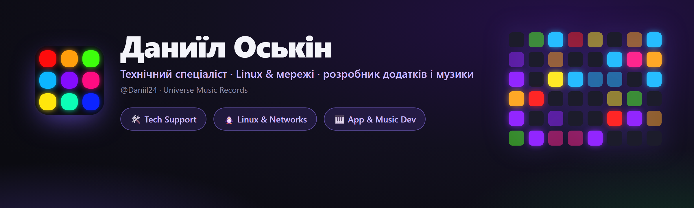

<div align="center">



<br><br>

[](https://t.me/universemusicrecords)
[](mailto:doskin50@gmail.com)
[](https://open.spotify.com/artist/52i91BwNbmPpqL4KVlFeIG)

<br>

[Русский](README.md) · [English](README.en.md) · 🌍 **Українська** · [Deutsch](README.de.md) · [Español](README.es.md) · [Français](README.fr.md)

</div>

---

## 👋 Про мене

Привіт! Мене звати **Даниїл Оськін**. Я на стику двох світів: **технології** та **музика**.

Удень я — **технічний спеціаліст** телеком-провайдерів (**Ростелеком**, **ЕР-Телеком Холдинг**): працюю на 2-й лінії підтримки, лагоджу мережі, налаштовую обладнання, копаюсь у Linux. Увечері — **пишу власні застосунки** на Python і **роблю музику** під брендом **Universe Music Records / Magic Music Record**.

Мені подобається доводити речі до стану «як на продаж»: щоб працювало надійно й виглядало красиво — чи то діагностика GPON-мережі, власний VPN-сервіс, чи десктоп-застосунок з анімаціями та світломузикою.

📍 Томськ · 🌐 віддалено · 🇷🇺 RU / 🇬🇧 EN

---

## 💼 Чим займаюсь

<table>
<tr>
<td width="33%" valign="top">

### 🛠 Техпідтримка
2-а лінія в телекомі. Діагностика мереж, **GPON/IPTV**, налаштування роутерів і ONT, робота з інцидентами, **SLA**, Jira / Service Desk.

</td>
<td width="33%" valign="top">

### 🐧 Linux & мережі
TCP/IP, DNS · DHCP · NAT · PPPoE · VLAN. Власний **VPN на WireGuard/OpenVPN**, Bash-автоматизація, SSH, Wireshark, Debian/Ubuntu.

</td>
<td width="33%" valign="top">

### 🎹 Розробка & музика
Десктоп-застосунки на **Python** (MIDI, звук, світломузика) та продюсування під **Magic Music Record**.

</td>
</tr>
</table>

---

## 🚀 Мої проєкти

<div align="center">

<a href="https://github.com/Daniil24/launchpad-deck"></a>
<a href="https://github.com/Daniil24/minilab-key-deck"></a>

</div>

### 🎛 [Launchpad Deck](https://github.com/Daniil24/launchpad-deck)
Перетворює світловий пед **Novation Launchpad** на **макро-деку** (як Stream Deck) **і** аудіо-реактивну **світломузику** водночас.
- 60+ генеративних сцен, запуск програм, керування OBS, per-app гучність, мут мікрофона.
- Адаптація під Mini MK3 / X / **Pro MK3 (10×10)**. Один `.exe`, **6 мов**, анімації.

### 🎹 [MiniLab Key Deck](https://github.com/Daniil24/minilab-key-deck)
Перетворює **Arturia MiniLab 3** (і будь-який MIDI-контролер) на клавіатуру для **ритм-ігор** — Fortnite Festival, osu!, Clone Hero.
- Маппінг клавіш/педів, **velocity-зони**, крутилки/фейдери → колесо/гучність/клавіші.
- Живий індикатор октави, **світломузика на педах**, трей + хоткей, **6 мов**, один `.exe`.

### 🛡 MAGIC VPN — Telegram VPN-сервіс
Власний **VPN-сервіс у Telegram**: пишеш боту — отримуєш ключ і підписку.
- Багато серверів і локацій, протоколи **VLESS / Hysteria2**, обхід блокувань (Cloudflare WS-CDN).
- **Клієнти для Android і ПК**, оплата на сайті, авто-вибір локації, реклама-за-хвилини, стелс-режим на Android.

[](https://telegram.me/magicvpnsub_bot)
[](https://pay.magicvpssub.ru/)

---

## 🧰 Стек

**Розробка**  


**Linux & мережі**  


**Обладнання та підтримка**  


---

## 🎧 Музика — *Magic Music Record*

Я пишу та продюсую музику під іменем **Magic Music Record** (лейбл **Universe Music Records**). Слухай на улюбленому майданчику:

[](https://open.spotify.com/artist/52i91BwNbmPpqL4KVlFeIG)
[](https://www.deezer.com/en/artist/97111002)
[](https://www.youtube.com/channel/UClHADc2wuHte3u5XV55JI6Q)
[](https://www.youtube.com/channel/UCEZSIzoLzq3HVlG4dGNnD4g)
[](https://soundbetter.com/profiles/477542-magic-music-record)

---

## 🌱 Зараз

- 🔭 Розвиваю **Launchpad Deck** і **MiniLab Key Deck** (нові функції, мови).
- 📚 Заглиблююсь у **Linux-адміністрування та мережеву інженерію**.
- 🎼 Пишу нову музику під **Magic Music Record**.
- 🛡 Розвиваю власний **VPN-сервіс**.

---

## 💜 Підтримати

Проєкти безкоштовні. Якщо допомогли — можна підтримати криптою **TON (Toncoin)**:

```
UQAK1sIJqPVn9ND8JTOEUlrBFyAiVU0j6IiiXczTM7YmX4CB
```

[](https://app.tonkeeper.com/transfer/UQAK1sIJqPVn9ND8JTOEUlrBFyAiVU0j6IiiXczTM7YmX4CB)

<div align="center">

<br>

**Universe Music Records · Magic Music Record**

</div>
